# Resumen de la Estructura Completa del Proyecto

A continuación se muestra un análisis completo compuesto por:

- [**Diagrama Mermaid**](#-esquema-de-flujo-de-llamadas-del-proyecto): Visualización del flujo de dependencias
- [**Tabla de dependencias**](#-tabla-detallada-de-dependencias): Cada función, a qué llama y de dónde
- [**Flujos principales**](#-flujos-principales): Los tres escenarios clave del proyecto
- [**Capas arquitectónicas**](#-capas-de-la-arquitectura): Cómo se organiza el proyecto en niveles

## 📊 Esquema de Flujo de Llamadas del Proyecto

```mermaid
graph TB
    subgraph "main.py<br/>(Punto de Entrada)"
        main["main()"]
        demo_est["demo_verificar_estructura()"]
        demo_perf["demo_perfiles()"]
        demo_mem["demo_memoria()"]
        demo_faq_fn["demo_faq()"]
        demo_comp["demo_comparativa_seguridad()"]
        impr_res["imprimir_resultado()"]
        impr_comp["imprimir_resultado_comparativa()"]
    end

    subgraph "logic.py<br/>(Orquestación)"
        proc_turno["procesar_turno()"]
        crear_est["crear_estado_demo()"]
        demo_sel_faq["demo_seleccion_faq()"]
        parsear_resp["parsear_respuesta_tutor()"]
        proc_vuln["procesar_turno_vulnerable()"]
        proc_seg["procesar_turno_seguro()"]
        resp_ok["respuesta_ok()"]
        resp_err["respuesta_error()"]
    end

    subgraph "prompts.py<br/>(Construcción de Prompts)"
        build_faq["build_faq_block()"]
        build_hist["build_history_block()"]
        build_asist["build_assistant_prompt()"]
        build_vuln["build_vulnerable_prompt()"]
        build_secure["build_secure_prompt()"]
        resolver_perf["resolver_perfil()"]
    end

    subgraph "state.py<br/>(Gestión de Estado)"
        init_est["inicializar_estado()"]
        append_user["append_user()"]
        append_asist["append_assistant()"]
        ultimos_n["ultimos_n()"]
        act_perfil["actualizar_perfil_desde_mensaje()"]
    end

    subgraph "context.py<br/>(Selección FAQ)"
        cargar_faq_fn["cargar_faq()"]
        selec_faq["seleccionar_faq()"]
    end

    subgraph "validators.py<br/>(Validación)"
        val_input["validate_input()"]
        parece_dom["parece_dominio_python()"]
        rechaz_dom["rechazo_fuera_de_dominio()"]
    end

    subgraph "gemini_client.py<br/>(Llamadas API)"
        count_tok["count_tokens()"]
        llamar_gem["llamar_gemini()"]
        llamar_gem_json["llamar_gemini_json()"]
        safe_gen["safe_generate()"]
    end

    subgraph "config.py<br/>(Constantes)"
        config["MODEL, TEMPERATURE, PERFILES<br/>SYSTEM_PROMPT, DOMINIO_KEYWORDS<br/>PATRONES_SOSPECHOSOS, etc."]
    end

    subgraph "gemini_auth.py<br/>(Autenticación)"
        config_auth["configurar_gemini_api_key()"]
    end

    %% main.py calls
    main --> demo_est
    main --> demo_perf
    main --> demo_mem
    main --> demo_faq_fn
    main --> demo_comp
    demo_est --> cargar_faq_fn
    demo_perf --> crear_est
    demo_perf --> proc_turno
    demo_mem --> crear_est
    demo_mem --> proc_turno
    demo_faq_fn --> demo_sel_faq
    demo_faq_fn --> crear_est
    demo_faq_fn --> proc_turno
    demo_comp --> proc_vuln
    demo_comp --> proc_seg
    impr_res -.-> main
    impr_comp -.-> main

    %% logic.py calls
    crear_est --> init_est
    demo_sel_faq --> cargar_faq_fn
    demo_sel_faq --> selec_faq
    proc_turno --> build_asist
    proc_turno --> safe_gen
    proc_turno --> resp_ok
    proc_vuln --> build_vuln
    proc_vuln --> safe_gen
    proc_seg --> build_secure
    proc_seg --> safe_gen

    %% prompts.py calls
    build_asist --> build_faq
    build_asist --> build_hist
    build_asist --> resolver_perf
    resolver_perf --> config
    build_faq -.-> config
    build_hist -.-> config
    build_vuln --> config
    build_secure --> config

    %% state.py usage
    proc_turno -.-> append_user
    proc_turno -.-> ultimos_n
    proc_turno -.-> act_perfil

    %% validators.py
    proc_vuln -.-> val_input
    proc_seg --> val_input
    proc_seg --> parece_dom
    proc_seg --> rechaz_dom
    val_input --> config
    parece_dom --> config

    %% gemini_client.py
    safe_gen --> count_tok
    safe_gen --> llamar_gem
    safe_gen --> llamar_gem_json
    llamar_gem --> config_auth
    llamar_gem_json --> config_auth

    style main fill:#ff6b6b
    style logic.py fill:#4ecdc4
    style prompts.py fill:#45b7d1
    style state.py fill:#96ceb4
    style context.py fill:#dfe6e9
    style validators.py fill:#ffeaa7
    style gemini_client.py fill:#dfe6e9
    style config.py fill:#e8e8e8
    style gemini_auth.py fill:#e8e8e8
```



## 📋 Tabla Detallada de Dependencias

| **Archivo** | **Función** | **Llama a** | **Origen** | **Tipo** |
|---|---|---|---|---|
| **main.py** | `main()` | Todas las demos | Mismo archivo | Orquestación |
| | `demo_verificar_estructura()` | `cargar_faq()` | context.py | Datos |
| | `demo_perfiles()` | `crear_estado_demo()`, `procesar_turno()` | logic.py | Orquestación |
| | `demo_memoria()` | `crear_estado_demo()`, `procesar_turno()` | logic.py | Orquestación |
| | `demo_faq()` | `demo_seleccion_faq()`, `crear_estado_demo()`, `procesar_turno()` | logic.py | Orquestación |
| | `demo_comparativa_seguridad()` | `procesar_turno_vulnerable()`, `procesar_turno_seguro()` | logic.py | Seguridad |
| **logic.py** | `procesar_turno()` | `build_assistant_prompt()`, `safe_generate()` | prompts.py, gemini_client.py | Núcleo |
| | `crear_estado_demo()` | `inicializar_estado()` | state.py | Estado |
| | `demo_seleccion_faq()` | `cargar_faq()`, `seleccionar_faq()` | context.py | Datos |
| | `procesar_turno_vulnerable()` | `build_vulnerable_prompt()`, `safe_generate()` | prompts.py, gemini_client.py | Seguridad |
| | `procesar_turno_seguro()` | `validate_input()`, `parece_dominio_python()`, `build_secure_prompt()`, `safe_generate()` | validators.py, prompts.py, gemini_client.py | Seguridad |
| **prompts.py** | `build_assistant_prompt()` | `build_faq_block()`, `build_history_block()`, `resolver_perfil()` | Mismo archivo | Construcción |
| | `build_faq_block()` | - | config.py (constantes) | Construcción |
| | `build_history_block()` | - | - | Construcción |
| | `build_vulnerable_prompt()` | - | config.py | Construcción |
| | `build_secure_prompt()` | - | config.py | Construcción |
| | `resolver_perfil()` | - | config.py | Utilidad |
| **state.py** | `inicializar_estado()` | - | - | Estado |
| | `append_user()`, `append_assistant()` | - | - | Utilidad |
| | `ultimos_n()` | - | - | Utilidad |
| | `actualizar_perfil_desde_mensaje()` | (sin LLM) | - | Estado |
| **context.py** | `cargar_faq()` | - | Lee faq.json | Datos |
| | `seleccionar_faq()` | - | - | Datos |
| **validators.py** | `validate_input()` | - | config.py | Validación |
| | `parece_dominio_python()` | - | config.py | Validación |
| | `rechazo_fuera_de_dominio()` | - | - | Validación |
| **gemini_client.py** | `safe_generate()` | `count_tokens()`, `llamar_gemini()`, `llamar_gemini_json()` | Mismo archivo | API |
| | `llamar_gemini()` | `_metricas_from_response()` | Mismo archivo | API |
| | `llamar_gemini_json()` | `_metricas_from_response()` | Mismo archivo | API |
| | `count_tokens()` | - | - | API |
| **config.py** | - | (Solo constantes) | - | Configuración |
| **gemini_auth.py** | `configurar_gemini_api_key()` | (Cargado por gemini_client.py) | - | Autenticación |

## 🔄 Flujos Principales

### **Flujo 1: Demo Básica (Fase 1)**
```
main() 
  → demo_perfiles() 
    → crear_estado_demo() → inicializar_estado()
    → procesar_turno() → build_assistant_prompt() → resolver_perfil()
                      → safe_generate() → llamar_gemini()
```

### **Flujo 2: Demo con FAQ**
```
main() 
  → demo_faq() 
    → demo_seleccion_faq() → cargar_faq() → seleccionar_faq()
    → procesar_turno() → build_assistant_prompt()
                      → safe_generate() → llamar_gemini()
```

### **Flujo 3: Seguridad (Fase 2)**
```
main() 
  → demo_comparativa_seguridad()
    → procesar_turno_vulnerable() 
      → build_vulnerable_prompt() 
      → safe_generate() → llamar_gemini()
    
    → procesar_turno_seguro()
      → validate_input()          [Validación]
      → parece_dominio_python()   [Filtro de dominio]
      → build_secure_prompt()     [Prompt seguro]
      → safe_generate() → llamar_gemini()
```

## 📌 Capas de la Arquitectura

| **Capa** | **Archivos** | **Responsabilidad** |
|---|---|---|
| **Entrada** | main.py | Demos y punto de entrada |
| **Orquestación** | logic.py | Coordina el flujo de turnos |
| **Validación** | validators.py | Capa 1: Validaciones de input/dominio |
| **Prompts** | prompts.py | Capa 2: Construcción inteligente de prompts |
| **Estado** | state.py | Capa 3: Gestión de contexto/historial |
| **Contexto** | context.py | Capa 3: Selección de FAQ relevante |
| **API** | gemini_client.py | Capa 4: Comunicación con Gemini |
| **Config** | config.py | Capa transversal: Constantes globales |
| **Auth** | gemini_auth.py | Capa transversal: Autenticación |

## 🔗 Resumen de Dependencias Entre Capas

- **main.py** → logic.py, context.py
- **logic.py** → validators.py, prompts.py, context.py, state.py, gemini_client.py
- **prompts.py** → (solo constantes de config)
- **state.py** → (sin dependencias internas)
- **context.py** → (sin dependencias internas, lee datos de disco)
- **validators.py** → (solo constantes de config)
- **gemini_client.py** → gemini_auth.py, config
- **config.py** → (no depende de nada)
- **gemini_auth.py** → (dependencias externas: dotenv, getpass, os)
